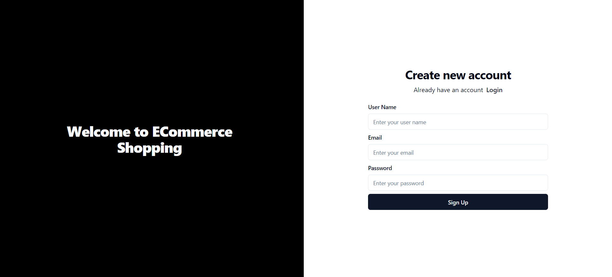
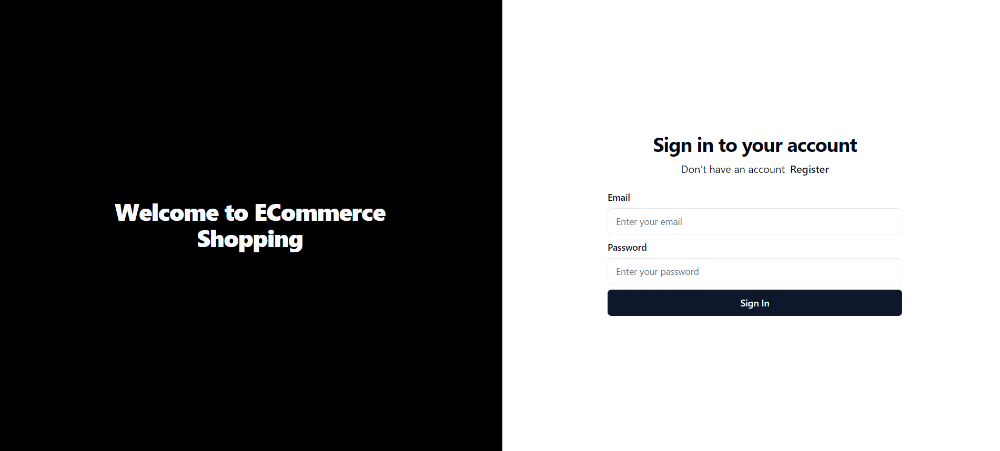
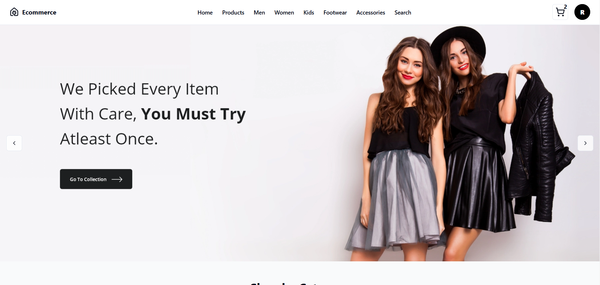
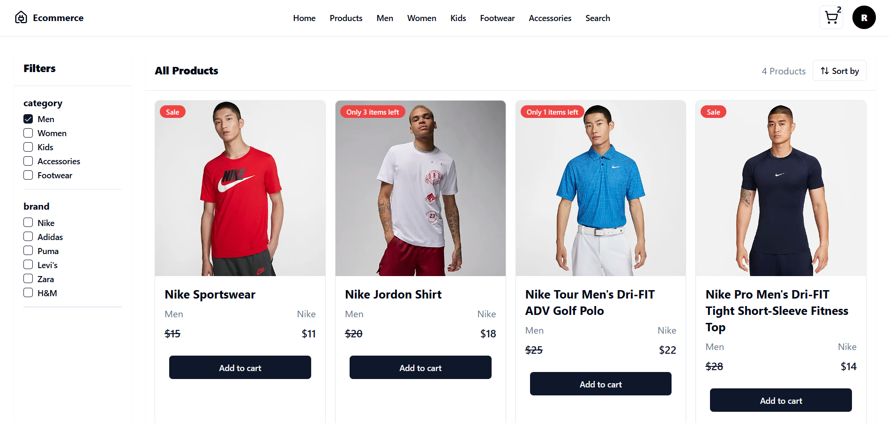
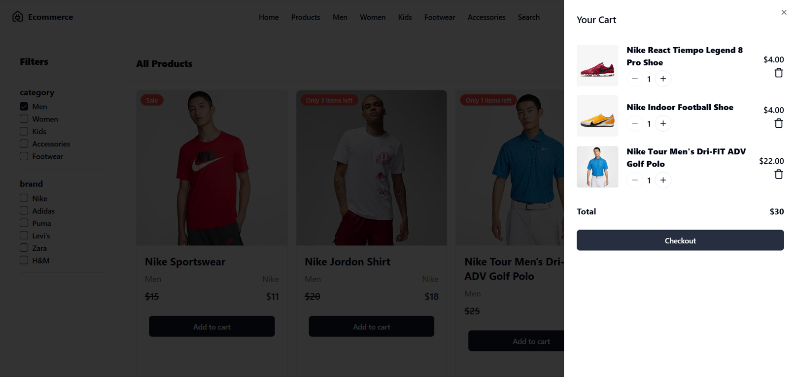
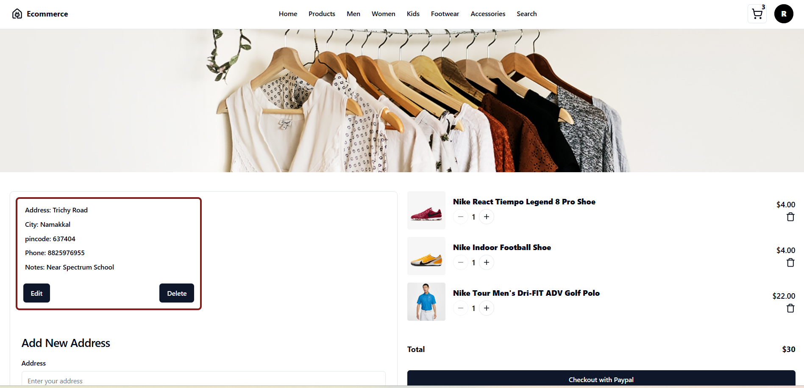
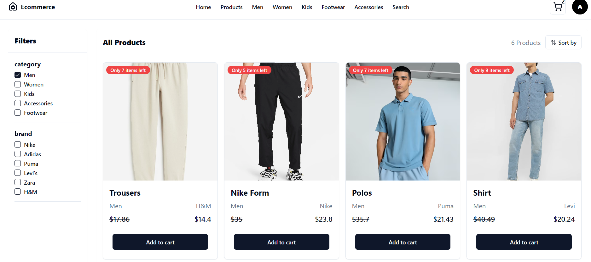
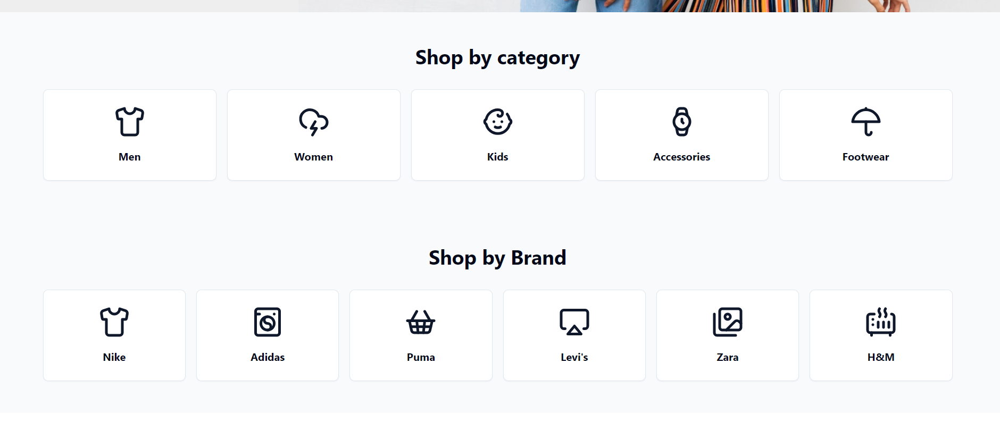

# MERN E-Commerce Website

## Overview :

A full-stack e-commerce website using the MERN stack (MongoDB, Express.js, React, Node.js). Features include product browsing, user authentication, shopping cart.

## Features

- Product Listings
- User Authentication
- Shopping Cart
- Order Management
- Admin Dashboard

## Technologies

- **Frontend:** React, Tailwind CSS
- **Backend:** Node.js, Express.js, MongoDB
- **Tools:** Axios, JWT, Bcrypt

## Project Screenshots

Here are some screenshots of the project:

